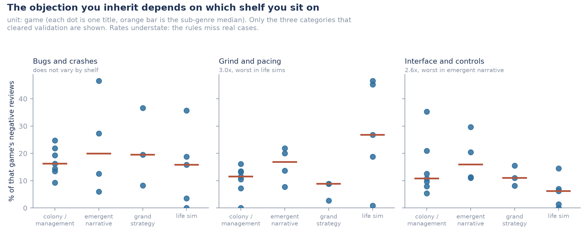
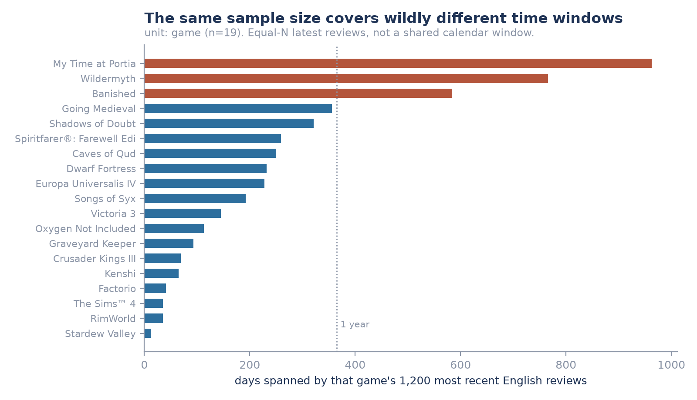

# What players object to in simulation games, and what it takes to measure it

A study of **22,796 public Steam reviews across 19 simulation titles**, asking what players in negative
reviews actually complain about and whether those complaints differ by sub-genre. Two days of work,
15 commits, everything reproducible from cache.

**Deck:** [`Steam_Game_Reception_Validation_Deck.pptx`](Steam_Game_Reception_Validation_Deck.pptx) (13 slides)
· **Full validation report:** [VALIDATION_V1.md](VALIDATION_V1.md) · **Design:** [SCOPE.md](SCOPE.md)

---

## The finding

Using only the three objection categories that passed validation, **the complaint you inherit depends
on which shelf you position on.**



| Objection | Colony | Emergent | Grand strategy | Life sim | Varies? |
|---|---|---|---|---|---|
| Bugs and crashes | 16.2% | 19.9% | 19.5% | 15.9% | **No** (1.2x) |
| Grind and pacing | 11.5% | 16.8% | 8.8% | **26.8%** | **Yes** (3.0x) |
| Interface and controls | 10.8% | **15.9%** | 11.0% | 6.2% | **Yes** (2.6x) |

*Median share of each game's negative reviews. Unit is the game, not the review.*

**Bugs are the price of entry, not a positioning variable.** Roughly one negative review in six blames
defects, and that holds across all four sub-genres. Nobody wins by being less broken than the category;
they only lose by being more.

**Grind is the life-sim tax.** Three times the rate of grand strategy, and the two worst titles in the
whole set are both life sims (Spiritfarer 46.5%, Graveyard Keeper 45.2%). Position toward cozy and you
inherit an audience that will punish pacing.

**Legibility is the emergent-narrative tax.** Interface complaints run highest where systems are
deepest, led by Dwarf Fortress at 35.2% and Caves of Qud at 29.7%. Depth and opacity arrive together
unless someone works to separate them.

For a new entrant: budget for defects regardless, and pick which of the other two problems you would
rather own, because the shelf you choose largely chooses for you.

---

## Four things that will break your Steam review analysis

These hold independently of any coding scheme, and cost a re-pull to learn.

**1. `filter=all` is a trap with three parts.** It is the helpfulness-ranked view rather than
everything, its paging stalls near 200 reviews, and it runs measurably more negative. A first pull
using it returned **92 of 13,082** available reviews for one game, with no error. Use `filter=recent`.

**2. "The most recent 1,200 reviews" is not a time window.** It spans 13 days for *Stardew Valley* and
963 for *My Time at Portia*, median 192, because review volume differs across these games by nearly
thirty times. Never call such a sample "current sentiment".

**3. Reviews are clustered inside games.** A sub-genre here holds 3 to 7 titles, so the game count is
the effective sample size, not the review count. Pooled review-level tests would be badly overconfident
and are not run anywhere in this repository.

**4. Steam withholds review-bomb periods by default.** Four games clearly affected, the largest
*Factorio* at 3,355 reviews. Kept the default and measured it rather than inheriting it silently
([`outputs/offtopic_sensitivity.csv`](outputs/offtopic_sensitivity.csv)).



---

## What did not work, and why that is reported here

I wrote 16 objection categories, froze them, then hand-coded 150 held-back reviews myself and scored
the frozen rules against my own labels. **Most of the categories failed.**

Rules and hand-coding produced the same label set on 30 of 150 reviews (20%). Pooled, the rules were
right about half the time they fired and caught about half of what was there. Nine of 16 categories had
enough support to score at all, with a median F1 of 0.562.

| Category | Precision | Recall | F1 |
|---|---|---|---|
| Bugs and crashes | 0.80 | 0.63 | **0.71** |
| Grind and pacing | 0.67 | 0.67 | 0.67 |
| Unexplained systems | 0.60 | 0.75 | 0.67 |
| Interface and controls | 0.56 | 0.56 | 0.56 |
| Unfinished or abandoned | 0.53 | 0.53 | 0.53 |
| Publisher behaviour | 0.40 | 0.71 | 0.51 |
| Shallow or repetitive | 0.86 | **0.27** | 0.41 |
| **Hollow generated content** | **0.25** | **0.11** | **0.15** |
| Unfair randomness | **0.00** | n/a | n/a |

Full table with counts: [`outputs/validation_metrics.csv`](outputs/validation_metrics.csv). Failure
analysis attributed to individual patterns: [VALIDATION_V1.md](VALIDATION_V1.md).

**The pattern is the result.** Rules work where the language is literal and fail where it requires
judgement. Bugs scored 0.71 because people write "it crashed". Hollow generated content scored 0.15
because nobody writes "the generation is visible"; they write something that means it.

This is a known limitation in content analysis rather than a novel discovery: interpretive constructs
generally need trained coders and iterative category refinement, and reliability below roughly 0.67 on
standard measures is normally treated as a signal to revise the scheme rather than to scale it. What
this project adds is a measurement of exactly how far keyword rules get you on this material, in this
domain, against a human standard.

**One independent check.** A second reader (Codex) coded 30 of the 150 on rows selected before either
of us began. Exact agreement was 15 of 30, 50%. That reader is an AI, not a second analyst, so it is
not human validation and does not establish a ceiling. It is suggestive that these categories carry
real ambiguity, and it is the reason the next step is category refinement rather than better patterns.

**What I nearly reported instead.** Early on, rule matches for hollow generated content concentrated
neatly in emergent-narrative games, three of four between 7% and 19% against near-zero elsewhere. It
looked like the finding. It is not evidence of anything, because the rule producing those matches is
wrong three times in four. A clean pattern made of unreliable measurements is still unreliable.

---

## Method

19 titles spanning four positioning axes: colony and management (7), grand strategy and dynasty (3),
emergent narrative (4), life sim (5). Purposively chosen, not random, so results describe this set and
do not estimate a category population. English reviews only, up to 1,200 per game via `filter=recent`.

Discovery and held-out samples were drawn, hashed and **committed before any review text was read**.
The codebook was **frozen** before it was applied. The held-out sheet was **blinded**: no game name, no
sub-genre, no machine predictions, shuffled order. Two weaknesses were **written down before validation
ran**, so they were predictions rather than excuses.

Those four choices are why a negative result exists at all. Without them the rules would have been
edited and a finding reported.

Full design and limitations in [SCOPE.md](SCOPE.md); categories, coding rules and authorship in
[CODEBOOK.md](CODEBOOK.md).

## Reproduce it

```bash
py src/01_resolve_comparison_set.py   # verify appids against the store API by name
py src/02_pull_reviews.py             # reviews + population denominators
py src/03_validate.py                 # acceptance gate; exits non-zero on failure
py src/04_freeze.py create            # hash manifest
py src/05_split.py                    # discovery/held-out IDs, before reading any text
py src/07_apply.py                    # apply the frozen rules
py src/08_coding_sheet.py             # blinded held-out sheet
py src/14_analyst_labels.py           # ingest hand-coded labels
py src/12_metrics.py                  # per-category scores
py src/17_supported_finding.py        # the finding, using validated categories only
py src/09_figures.py                  # figures
py src/verify.py                      # manifests + lineage
```

Every API response is cached, so a re-run makes no network calls and reproduces identical hashes. Raw
pulls are gitignored; the hand-coded labels are committed because they are primary data that cannot be
regenerated. `py src/test_gate.py` runs 16 checks confirming the validation gate fails on broken input
without touching any output file.

## Honest notes (data caveats)

- **The finding rests on three categories out of sixteen.** The other thirteen either failed validation
  or had too little support to score.
- **Rates understate.** Recall is 0.63, 0.67 and 0.56 for the three categories used, so every level
  above is lower than the truth. Comparing games is only fair if the rules miss at a similar rate
  everywhere, which is plausible but unverified.
- **English only.** I cannot validate coding in languages I do not read.
- **The comparison set is purposive**, not random. Findings characterise these 19 games.
- **Steam offers no random ordering.** Every available ordering is biased in a known way; the choice is
  which known bias to take and state.
- **The sample runs harsher than each game's lifetime record in 17 of 19 games.** Compatible with
  sentiment changing over time, but this design cannot separate that from unequal time coverage and
  non-random ordering. Do not report it as drift.
- **31 of 150 negative reviews carried an objection no category covered.** The scheme is incomplete as
  well as imprecise.

## How I used AI

This project is AI-assisted throughout, and the codebook in particular is **an AI-drafted candidate**,
not an analyst-authored instrument. An AI assistant read the 100-review discovery sample, proposed the
16 objection categories, wrote the rules that operationalise them, ran them across all 3,004 negative
reviews, and wrote the collection and scoring code.

What stays with me: the question, the scope, the verification, and every interpretation that ships.
The held-out 150 are coded by me against the blinded sheet, in `outputs/analyst_labels.csv`, and that
coding is the single reference standard this repository holds.

A second AI (Codex) independently read 30 of the 150, on rows selected by `src/10_spotcheck_select.py`
before coding began. Its exact label sets agree with mine on 15 of 30 (50%). That is not human
validation and does not replace the analyst standard, but it is the only independent second reading
here.

No precision or accuracy figure appears anywhere in this repository without saying who produced the
labels behind it. The most useful thing AI produced here was five confident, error-free wrong answers:
a pull that silently truncated most games, a validation gate that reported success on unusable data,
that same gate destroying good outputs while correctly failing, a hash manifest nothing ever verified,
and a coding sheet truncated mid-review. None raised an error. Every one was caught by reconciling
against an independent source, never by rereading the code.

## What comes next

The measurement problem blocks the interesting questions. A study of how complaints shift across a
game's life, or of what players praise, both need an instrument that works on interpretive categories.

So the next question is whether a language model clears the bar keyword rules could not, measured
against this same held-out set. This project produced what that test needs: 150 reviews with human
reference labels, a frozen baseline with published scores, a scoring script that already accepts an
alternate label file, and an independent second reading for context.
